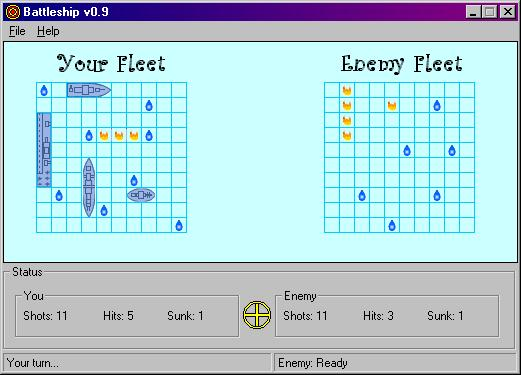

## Battleship v0\.9

### Description

This is the classic Battleship game that I have made in Visual Basic. It can be played over the internet or LAN. It's still an early version so there could be a few problems, but it seems to work pretty good on my two computers, and the game should be fully playable.
 
### More Info
 

             |
---                |---
**Submitted On**   |2003-05-04 21:59:46
**By**             |[Caleb Martin](https://github.com/Planet-Source-Code/PSCIndex/blob/master/ByAuthor/caleb-martin.md)
**Level**          |Intermediate
**User Rating**    |4.0 (8 globes from 2 users)
**Compatibility**  |VB 5\.0, VB 6\.0
**Category**       |[Games](https://github.com/Planet-Source-Code/PSCIndex/blob/master/ByCategory/games__1-38.md)
**World**          |[Visual Basic](https://github.com/Planet-Source-Code/PSCIndex/blob/master/ByWorld/visual-basic.md)
**Archive File**   |[Battleship158367542003\.zip](https://github.com/Planet-Source-Code/caleb-martin-battleship-v0-9__1-45265/archive/master.zip)

